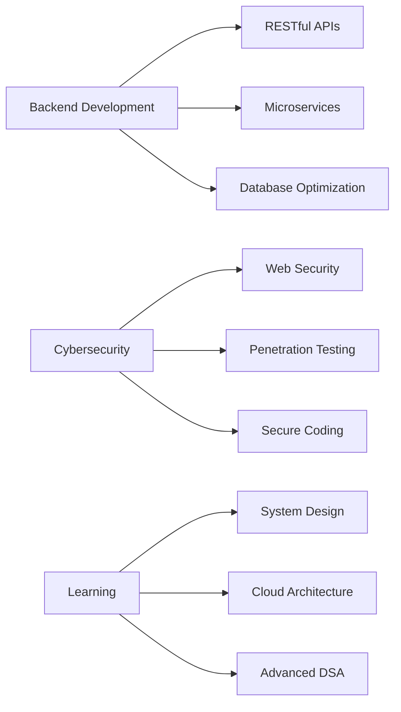

<div align="center">
  
# 👨‍💻 Hi, I'm Taksh Gandhi


[](https://www.linkedin.com/in/taksh-gandhi-4136222b7)
[](mailto:takshgandhi1507@gmail.com)
[](https://github.com/taksh1507)
[](https://www.instagram.com/taksh_1507)


</div>

---

## 🚀 About Me

```python
class Taksh:
    def __init__(self):
        self.name = "Taksh Gandhi"
        self.role = "Backend Developer & Cybersecurity Enthusiast"
        self.education = "3rd Year IT Engineering Student"
        self.location = "India"
        self.interests = ["Backend Development", "Cybersecurity", "Cloud Architecture"]
        
    def say_hi(self):
        print("Thanks for visiting! Let's build something amazing together!")

me = Taksh()
me.say_hi()
```

🎓 Currently pursuing **Bachelor's in Information Technology** (3rd Year)  
💡 Passionate about building **robust backend systems** and exploring **cybersecurity**  
🔭 Working on **scalable applications** and **security-focused projects**  
🌱 Currently learning **Advanced DSA**, **System Design**, and **Penetration Testing**  
⚡ Fun fact: I debug with coffee and secure systems for fun!

---

## 🛠️ Tech Arsenal

<div align="center">

### Languages & Frameworks


### Web Technologies


### Databases


### DevOps & Tools


### Specializations


</div>

---

## 🏗️ Featured Projects

<div align="center">

<table>
  <tr>
    <td width="50%">
      <h3 align="center">🔔 AlertMe</h3>
      <div align="center">
        <a href="https://github.com/taksh1507/AlertMe-Government-Deadline-Assistant" target="_blank">
          
        </a>
        <p>
          <strong>Real-time Notification & Alerting System</strong><br>
          Enterprise-grade notification platform with multi-channel support
        </p>
        <p>
          
          
        </p>
        <ul align="left">
          <li>🚨 Real-time event detection & processing</li>
          <li>⚙️ Flexible alert rules & escalation</li>
          <li>📊 Integration with monitoring platforms</li>
          <li>🔐 Role-based access control</li>
          <li>📝 Detailed audit trails</li>
        </ul>
      </div>
    </td>
    <td width="50%">
      <h3 align="center">📦 SubscriptionEngine</h3>
      <div align="center">
        <a href="https://github.com/taksh1507/subscriptionengine" target="_blank">
          
        </a>
        <p>
          <strong>Automated Subscription Management Platform</strong><br>
          Comprehensive solution for recurring billing & subscriptions
        </p>
        <p>
          
          
        </p>
        <ul align="left">
          <li>💳 Automated billing & invoicing</li>
          <li>📅 Subscription plan management</li>
          <li>🔗 Webhook & API integration</li>
          <li>📈 Revenue analytics dashboard</li>
          <li>🔔 Payment reminders & notifications</li>
        </ul>
      </div>
    </td>
  </tr>
</table>

</div>

---

## 📊 GitHub Analytics

<div align="center">
  


</div>

---

## 🏆 GitHub Achievements

<div align="center">
  


</div>

---

## 📈 Contribution Graph

<div align="center">


</div>

---

## 💼 Top Repositories

<div align="center">
  


</div>

---

## 🎯 Current Focus

<div align="center">



</div>

---

## 📚 Latest Skills & Certifications

<div align="center">

| Domain | Skills |
|--------|--------|
| **Backend** | RESTful APIs, Microservices, Authentication, Authorization |
| **Security** | OWASP Top 10, Secure Coding, Vulnerability Assessment |
| **Database** | Query Optimization, Indexing, Stored Procedures, Transactions |
| **DSA** | Trees, Graphs, Dynamic Programming, Greedy Algorithms |
| **Tools** | Git Workflows, CI/CD Basics, Docker (Learning) |

</div>

---

## 🎮 Coding Stats

<div align="center">

<!--START_SECTION:waka-->
<!--END_SECTION:waka-->


</div>

---

## 🌟 Open Source Contributions

<div align="center">


</div>

---

## 💡 Random Dev Quote

<div align="center">


</div>

---

## 🤝 Let's Collaborate!

<div align="center">

I'm always interested in collaborating on:
- 🔧 **Backend Projects** - APIs, Microservices, System Design
- 🔒 **Security Tools** - Vulnerability scanners, Security automation
- 📚 **Open Source** - Contributing to meaningful projects
- 💡 **Innovative Ideas** - Let's build something amazing!

### 📬 Reach Out

<p align="center">
  <a href="https://www.linkedin.com/in/taksh-gandhi-4136222b7" target="_blank">
    
  </a>
  <a href="mailto:takshgandhi1507@gmail.com" target="_blank">
    
  </a>
  <a href="https://github.com/taksh1507" target="_blank">
    
  </a>
  <a href="https://www.instagram.com/taksh_1507" target="_blank">
    
  </a>
</p>

---


<p align="center">
  
  
</p>

<p align="center">⭐️ From <a href="https://github.com/taksh1507">taksh1507</a> with 💙</p>

</div>
